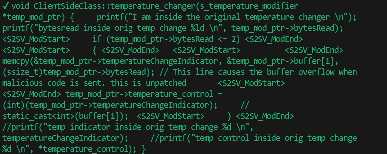

# Demo usage within Conti

## Patch Generation for HotPatch framework

This case is from a real-world vulnerability in our practice. The vulnerability is a stack-based buffer overflow in the cpp file `client.cpp`. 
The vulnerable code is shown below:

### Vulnerable Code Snippet
```c++
void ClientSideClass::temperature_changer(s_temperature_modifier *temp_mod_ptr)
{
    printf("I am inside the original temperature changer \n");
    printf("bytesread inside orig temp change %ld \n", temp_mod_ptr->bytesRead);
    memcpy(&temp_mod_ptr->temperatureChangeIndicator, &temp_mod_ptr->buffer[1], (ssize_t)4 * (temp_mod_ptr->bytesRead)); // This line causes the buffer overflow when malicious code is sent. this is unpatched
    temp_mod_ptr->temperature_control = static_cast<int>(temp_mod_ptr->temperatureChangeIndicator);     // static_cast<int>(buffer[1]);
    //printf("temp indicator inside orig temp change %d \n", temperatureChangeIndicator);
    //printf("temp control inside orig temp change %d \n", *temperature_control);
}
```
### Vulnerability Analysis
The vulnerable code is in the `temperature_changer` function. The `memcpy` function copies `temp_mod_ptr->buffer[1]` to `temp_mod_ptr->temperatureChangeIndicator` without checking the size of the buffer. This can lead to a buffer overflow. The `temperature_control` variable is assigned the value of `temperatureChangeIndicator`. The `temperatureChangeIndicator` variable is assigned the value of `temp_mod_ptr->buffer[1]`. This is a classic stack-based buffer overflow vulnerability.

### The Actual Patch

```c++
void ClientSideClass::temperature_changer(s_temperature_modifier *temp_mod_ptr)
{
    // ommited code
    if (temp_mod_ptr->bytesRead <= 2) // Patched code, added a check to ensure that the bytesRead is less than or equal to 2
    {
        memcpy(&temp_mod_ptr->temperatureChangeIndicator, &temp_mod_ptr->buffer[1], (ssize_t)4 * (temp_mod_ptr->bytesRead)); // This line causes the buffer overflow when malicious code is sent. this is unpatched
        temp_mod_ptr->temperature_control = static_cast<int>(temp_mod_ptr->temperatureChangeIndicator);     // static_cast<int>(buffer[1]);
    }
    // ommited code
}
```

### Patch Generation

We can directly feed the vulnerable code snippet to AutoPatcher to generate the patch code snippet.
Specifically, we can create a csv file (`./data/test_hotpatch_conti.csv` in our case) containing a column named `vuln_code` and a row containing the vulnerable code snippet. The csv file should be placed in the `data` folder. Then we can run the following command to generate the patch code snippet:

```bash
python autopatcher.py --model_path ./models --num_beams 1 --vuln_path ./data/test_hotpatch_conti.csv --output_dir ./autopatch_results
```

By feeding the vulnrable funciton code snippet to AutoPatcher, it can generate the following patch code snippet:

```c++
void ClientSideClass::temperature_changer(s_temperature_modifier*temp_mod_ptr) 
{     
    printf("I am inside the original temperature changer \n");
    printf("bytesread inside orig temp change %ld \n", temp_mod_ptr->bytesRead);
<S2SV_ModStart>     if (temp_mod_ptr->bytesRead <= 2) <S2SV_ModEnd>
<S2SV_ModStart>     { <S2SV_ModEnd>   
<S2SV_ModStart>          <S2SV_ModEnd>memcpy(&temp_mod_ptr->temperatureChangeIndicator, &temp_mod_ptr->buffer[1],
(ssize_t)temp_mod_ptr->bytesRead); // This line causes the buffer overflow when malicious code is sent. this is unpatched       
<S2SV_ModStart><S2SV_ModEnd> temp_mod_ptr->temperature_control = (int)(temp_mod_ptr->temperatureChangeIndicator);     // static_cast<int>(buffer[1]);  
<S2SV_ModStart>     } <S2SV_ModEnd>
    //printf("temp indicator inside orig temp change %d \n", temperatureChangeIndicator);     
    //printf("temp control inside orig temp change %d \n", *temperature_control); 
}
```

It can be seen that the patch code snippet has added a check to ensure that the `temp_mod_ptr->bytesRead` is less than or equal to 2. If the condition is met, the `memcpy` function will be executed. Otherwise, the function will return without executing the `memcpy` function. This patch code snippet effectively mitigates the buffer overflow vulnerability in the original code.

> Note: The patch code snippet generated by AutoPatcher may not be perfect especially for the indentation and formatting. It is recommended to manually adjust the patch code snippet to fit the coding style of the project.

The actual output from the AutoPatcher is shown in the figure below:

[](./demo_output_autopatcher.png)

The generated patch code snippet was output at the terminal and saved in the csv file `vuln_fix_pairs.csv` in the `autopatch_results` folder. The csv file contains the vulnerable code snippet (`vuln_code`) and the generated patch code snippet (`fix_code`). The patch code snippet can be directly copied to the source code file to patch the vulnerability.

### Patch Cadidate Selection

If you expect multiple patch candidates, you can increase the `num_beams` parameter to generate more patch candidates. For example, you can run the following command to generate 5 patch candidates:

```bash
python autopatcher.py --model_path ./models --num_beams 5 --vuln_path ./data/test_hotpatch_conti.csv --output_dir ./autopatch_results
```

